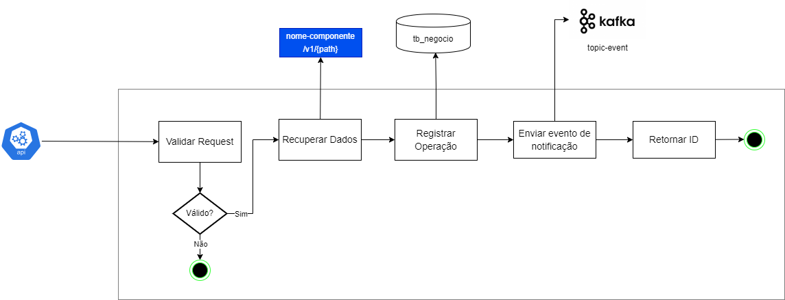

### Objetivo

``` text
Responsável por processar a originação do pedido Legado Fisital, orquestrando informações, realizando a integração para abrir contas, cadastros e produtos no legado.
```

### Responsáveis
``` text
Equipe / resnponsáveis por manter e evoluir este componente
```

- Equipe X

### Build
``` text
Como fazer o build (opcional, caso fuja do padrão) 
```

### Referências

- *DevConsole:* https://devconsole.sicredi.in/catalog/application/aberturadecontas-legado/aberturadecontas-legado-originacao
- ... 

### Stack
```
Componentes necessários (Quais tecnologias e porquê elas são usadas)
```

## APIs

### Swagger
- DEV: https://aberturadecontas-legado-originacao.dev.sicredi.cloud/swagger-ui/index.html
- UAT: https://aberturadecontas-legado-originacao.uat.sicredi.cloud/swagger-ui/index.html

### **POST** /componente/recurso
  ``` text
  Objetivo da API
  ```
#### Diagrama de fluxo (principais passos)
  

#### Detalhamento do Diagrama
  |        | Description |
  | ----------- | ----------- |
  | Validar request                    | Validar as informações da requisição |
  | Retornar ID                      | Response com as informações da operação gerada |

## Mensageria

### **Tópico:** topic-name
  ``` text
  Objetivo da integração com o Kafka
  ```

#### Diagrama de fluxo
  

#### Detalhamento do Diagrama (principais passos)
  |        | Description |
  | ----------- | ----------- |
  | Enviar evento de notificação    | Evento para notificar o cliente e outras integrações externas |
  | Enviar Response                      | Response com as informações da operação gerada |

## Documentação Complementar

- Links externos

## Decision Logs
| Data          | Autor             | Motivo        |
| :---          |    :----          |          :--- |
| dd/MM/yyyy    | @emailInfo               | Descrição do Motivo  |
| dd/MM/yyyy    | @emailInfo               | Descrição do Motivo      |